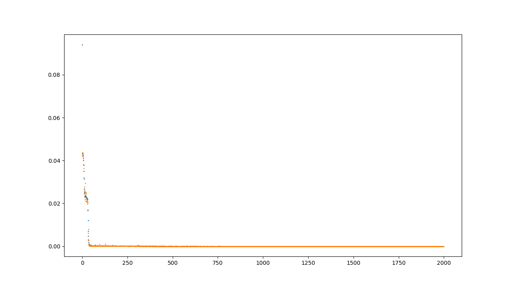
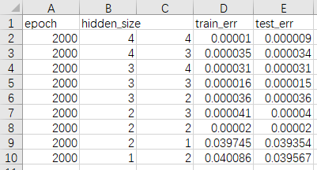
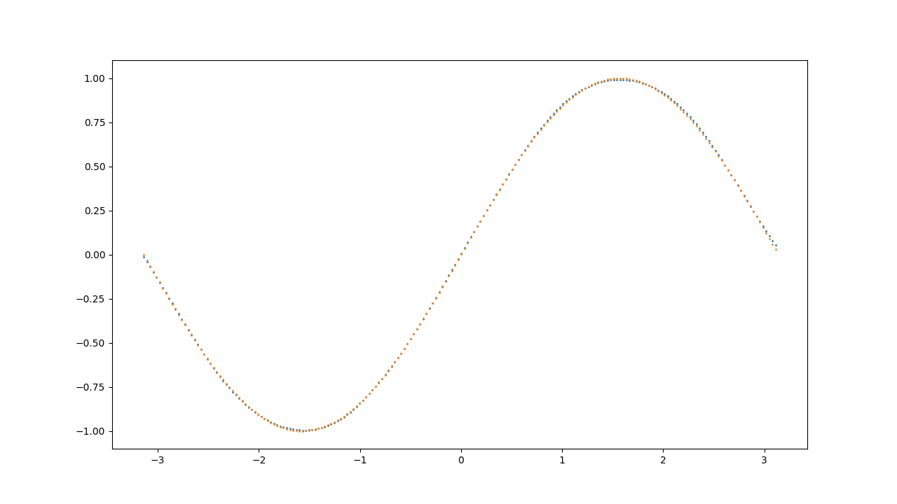

# Artificial Intelligence Lab 1
## 反向传播算法
### 代码基本架构

utils/config.py中保存了主要配置，包括网络形状、学习率、epoch等。
utils/process.py中实现了包括前向传播、反向传播等主要函数
运行时，从run.py进入。

### 超参与结构比较

采用epoch=2000，learning_rate测试不同网络结构，最终训练集和测试集上的MSE如下：

### 问题与思考

+ 最初拟合效果较差，仅当输入在0附近时拟合效果尚可，经尝试，将网络复杂度从两层隐藏层，各一个神经元提升至4个神经元，能够正确拟合。
+ 受tanh函数特性影响，sin(x)取值接近1时，输出层很难较好地拟合，实践中，尝试将训练集的输出减半，即拟合sin(x)/2，再将网络输出值乘以2，能较好地拟合上述情况。
+ 从损失函数变化发现，测试集上的平均损失小于训练集，检查发现当x接近-pi和pi时，偏差较大

